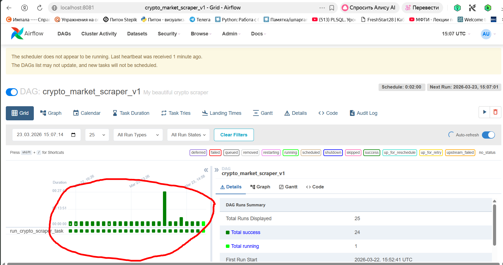
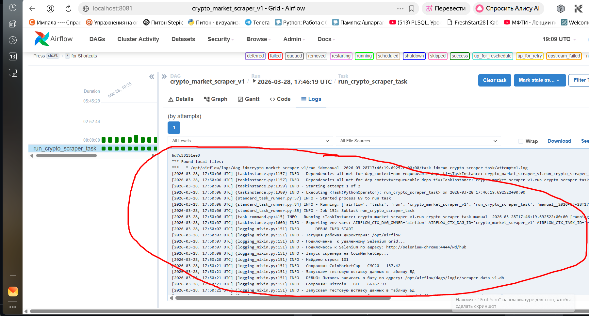

Crypto Market Scraper v1.0
Crypto Market Scraper — это  автоматизированная система (ETL-процесс) для мониторинга рынка криптовалют. Проект собирает актуальные данные о ценах и капитализации с CoinMarketCap и сохраняет их в структурированную базу данных для последующего анализа.

Архитектура системы

Проект реализован на базе Docker, что позволяет развернуть его на любой операционной системе (включая Windows) без конфликтов зависимостей.
Система состоит из двух изолированных контейнеров, работающих в связке:

Airflow Master:  Управляет расписанием задач, логированием и очередями.

Selenium Chrome:  Выделенный контейнер с браузером Chrome, который принимает команды от скрапера через удаленный драйвер (Remote Driver).

Технологический стек

Orchestration: Apache Airflow (настройка DAG с интервалом запуска 2 минуты).

Scraping: Selenium WebDriver (обработка динамического контента).

Data Storage: SQLite (хранение данных в реляционном виде).

Infrastructure: Docker & Docker Compose (оркестрация контейнеров).

Ключевые особенности

Умная обработка тикеров: Реализован алгоритм очистки данных, который корректно разделяет название монеты и её символ (например, "Bitcoin" и "BTC"), предотвращая дублирование в базе данных.

Контейнеризация драйверов: Использование selenium/standalone-chrome позволяет избежать проблем с установкой драйверов Chrome на локальную машину.

Промышленный подход к Windows: Проект настроен для работы через виртуализацию Docker, что обходит нативные ограничения Airflow на ОС Windows.

Модульная структура: Вся логика, работа с БД и библиотеки вынесены в отдельные модули внутри папки dags для удобства поддержки.

Быстрый старт

Клонирование репозитория:

Bash
git clone https://github.com/Alexey0161/Project3_cripto.git 

Подготавливаем окружение:

Установливаем/или проверяем, что установлены Docker и Docker Desktop. Создаем папку logs в корне проекта, если она отсутствует.

Запускаем систему:

Bash
docker-compose up -d

Примечание: Сборка образа при первом запуске может занять 2-3 минуты, так как за это время Docker устанавливает зависимости из requirements.txt.

Доступ к интерфейсу:
Открываем браузер и переходим по адресу http://localhost:8081.

Запускаем без Docker (Точка входа)

    для проверки работы скрапера без запуска Airflow:
1. Подготавливаем окружение
2. Из корня запускаем файл python dags/scraper_cripto.py- точка входа.

Примечание: Скрапер автоматически определяет, что запущен вне Airflow, и выполняет один цикл сбора данных.

База данных: Файл БД scraper_data_v1.db  создается автоматически в папке dags/bd_sqlite/. Пути менять вручную не нужно — система использует относительные пути проекта.

Система использует динамическое определение путей (os.path), поэтому база данных будет корректно создана в dags/bd_sqlite/ независимо от того, запускается проект из корня или из папки скрипта.

Функционирование этой системы проверено путем удаления существовавшего файла с таблице БД и запуском скрапинга. Файл с таблицей БД был создан автоматически и заполнен данными с сайта.

Структура данных

Данные сохраняются в таблицу со следующими полями:

coin_name   — Название криптовалюты.
coin_ticker - Тикер криптовалюты
price  — Актуальная цена в USD.
date_checked — Время замера (UTC).

Артефакты и результаты

Согласно ТЗ, результаты непрерывного скрапинга зафиксированы:

Сырые данные: Находятся в репозитории в файле dags/bd_sqlite/scraper_data_v1.db.

*)Анализ данных: В папке visualisations/ представлен отчет (Графики/CSV), показывающий динамику изменения цен криптовалют за период тестов.

*P.S.  Согласно ТЗ, анализ данных будет разработан во второй части проекта

Доказательство непрерывности и стабильности: На скриншотах в разделе " Визуализация работы ДАГ "  видны успешные запуски с интервалом в 2 минуты.

Имеющиеся пропуски на графике связаны с остановкой контейнеров для внесения правок в логику путей.
Визуализация работы ДАГ:

Визуализация работы ДАГ через select из таблицы scrap:

