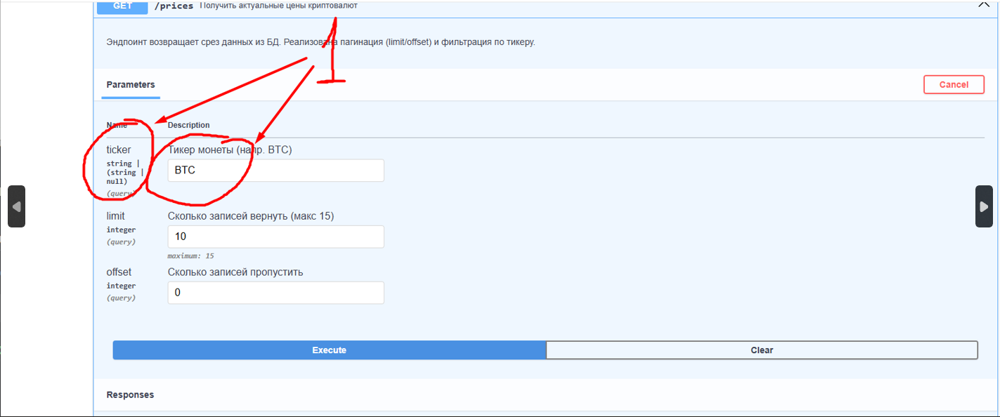
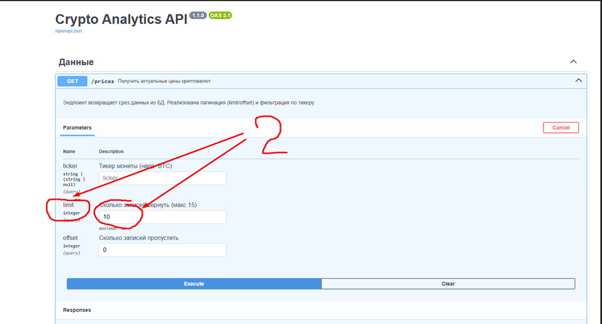
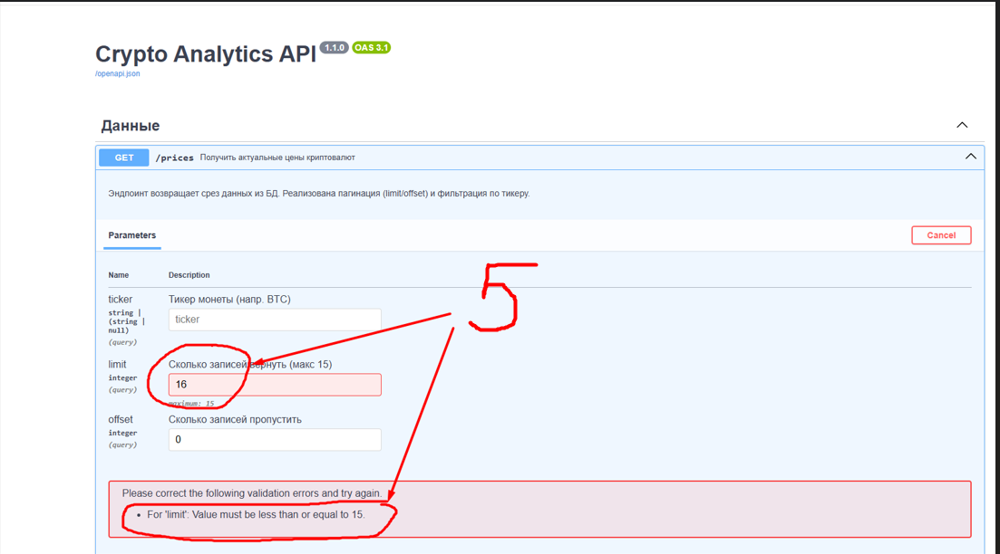

Проект "Crypto Analytics API" 

1. Описание

Crypto Analytics API v1.1.0
Сервис для предоставления аналитических данных о курсах криптовалют через REST API. Данные собираются скрапером и хранятся в SQLite.

2. Технологический стек

Python 3.10+

FastAPI (основной фреймворк)

Pydantic (валидация данных и схемы)

SQLite3 (база данных)

Uvicorn (ASGI сервер)

3. Инструкция по развертыванию 

Шаги:

3.1. Клонирование репозитория: git clone https://github.com/Alexey0161/Project3_cripto.git

3.2. Создание виртуального окружения: python -m venv venv

3.3.Активация: 
команды для Windows: venv\Scripts\activate

Установка зависимостей: pip install -r requirements.txt

Запуск сервера из корня проекта командой:
 uvicorn api.main_api_1:app --reload --port 8008

4. Как пользоваться (Usage)

Интерактивная документация доступна по адресу: http://127.0.0.1:8008/docs

4.1. Примеры реализации: 
Выдача информации о монетах в БД:
Пример : позиция 11 на скрин 
Настраиваемый фильтр позволяет фильтровать монеты по их тикеру:
Пример: позиция 1 на скрин 
Настраиваемый лимит, позволяет получать срез от 1 до 15 монет
Пример: позиция 2 на  скрин 
Настраиваемая порция выдачи позволяет пропускать заданное число строк в таблице БД
Пример: позиция 3 на скрин 
Выдача документации, сгенерированной автоматически:
Пример: позиция 4 на скрин 

5. Структура проекта

.
├── api/
│   └── main_api_1.py      # Основной файл API
├── dags/
│   └── logic/
│       └── scraper_data_v1.db  # База данных
├── requirements.txt       # Зависимости
└── README.md              # Документация

6. Особенности реализации 

6.1. Защита от перегрузки: Ограничение limit до 15 записей (валидация через le=15 в FastAPI).
Пример позиция 5 на скрин 

6.2. Типизация: Использование Pydantic-схем для чистоты данных.

6.3. Сортировка: Данные всегда отдаются от новых к старым (ORDER BY date_checked DESC).

7. Возможные проблемы при запуске API
Если команда uvicorn не распознается или модуль не найден:

Попробуйте принудительную установку внутри вашего окружения:

Bash
python -m pip install uvicorn fastapi
Запускайте сервер через модуль Python (это надежнее на Windows):

Bash
python -m uvicorn api.main_api_1:app --reload --port 8008
Это решит проблему, если системные пути (PATH) не подхватили установленные пакеты.

