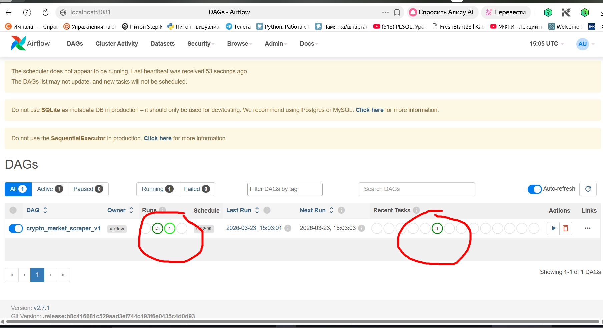
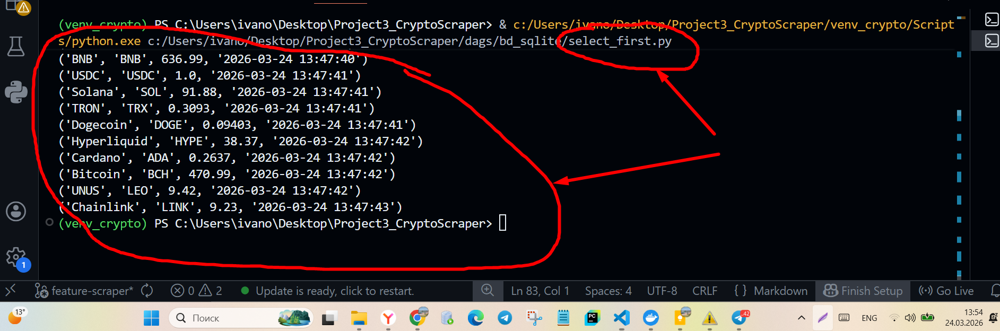
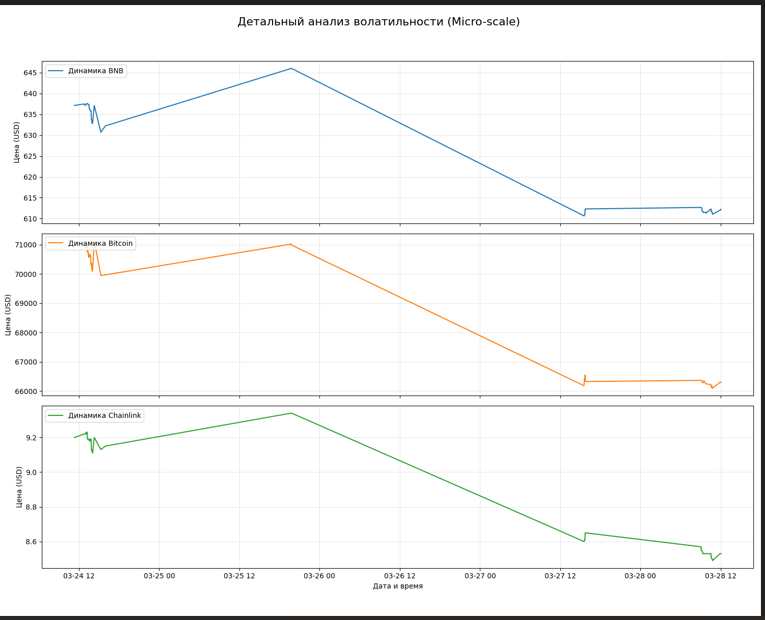

Crypto Market Scraper v1.0
Crypto Market Scraper — это  автоматизированная система (ETL-процесс) для мониторинга рынка криптовалют. Проект собирает актуальные данные о ценах и капитализации с CoinMarketCap и сохраняет их в структурированную базу данных для последующего анализа.

Crypto Market Scraper — это  автоматизированная система (ETL-процесс) для мониторинга рынка криптовалют. Проект собирает актуальные данные о ценах и капитализации с CoinMarketCap и сохраняет их в структурированную базу данных для последующего анализа.

Архитектура системы

Проект реализован на базе Docker, что позволяет развернуть его на любой операционной системе (включая Windows) без конфликтов зависимостей.
Система состоит из двух изолированных контейнеров, работающих в связке:

Airflow Master:  Управляет расписанием задач, логированием и очередями.

Selenium Chrome:  Выделенный контейнер с браузером Chrome, который принимает команды от скрапера через удаленный драйвер (Remote Driver).

Технологический стек

Orchestration: Apache Airflow (настройка DAG с интервалом запуска 2 минуты).

Scraping: Selenium WebDriver (обработка динамического контента).

Data Storage: SQLite (хранение данных в реляционном виде).

Infrastructure: Docker & Docker Compose (оркестрация контейнеров).

Ключевые особенности

Умная обработка тикеров: Реализован алгоритм очистки данных, который корректно разделяет название монеты и её символ (например, "Bitcoin" и "BTC"), предотвращая дублирование в базе данных.

Контейнеризация драйверов: Использование selenium/standalone-chrome позволяет избежать проблем с установкой драйверов Chrome на локальную машину.

Промышленный подход к Windows: Проект настроен для работы через виртуализацию Docker, что обходит нативные ограничения Airflow на ОС Windows.

Модульная структура: Вся логика, работа с БД и библиотеки вынесены в отдельные модули внутри папки dags для удобства поддержки.

Быстрый старт

Клонирование репозитория:

Bash
git clone https://github.com/Alexey0161/Project3_cripto.git 

Подготавливаем окружение:

Установливаем/или проверяем, что установлены Docker и Docker Desktop. Создаем папку logs в корне проекта, если она отсутствует.

Запускаем систему:

Bash
docker-compose up -d

Примечание: 1. Сборка образа при первом запуске может занять 2-3 минуты, так как за это время Docker устанавливает зависимости из requirements.txt.
2. Если контейнеры не стартуют с ошибкой port is already allocated, убедитесь, что порт 4444 и 8081 не заняты другими запущенными проектами. Используйте docker-compose down для остановки предыдущих сессий или команду docker stop $(docker ps -q) - это остановит сессии и освободит порт.

Доступ к интерфейсу:
Открываем браузер и переходим по адресу http://localhost:8081.

Запускаем без Docker (Точка входа)

    для проверки работы скрапера без запуска Airflow:
1. Подготавливаем окружение
2. Из корня запускаем файл python dags/scraper_cripto.py- точка входа.

Примечание: Скрапер автоматически определяет, что запущен вне Airflow, и выполняет один цикл сбора данных.

База данных: Файл БД scraper_data_v1.db  создается автоматически в папке dags\logic
Пути менять вручную не нужно — система использует относительные пути проекта.

Система использует динамическое определение путей (os.path), поэтому база данных будет корректно создана в dags/bd_sqlite/ независимо от того, запускается проект из корня или из папки скрипта.

Функционирование этой системы проверено путем удаления существовавшего файла с таблице БД и запуском скрапинга. Файл с таблицей БД был создан автоматически и заполнен данными с сайта.

Структура данных

Данные сохраняются в таблицу со следующими полями:

coin_name   — Название криптовалюты.
coin_ticker - Тикер криптовалюты
price  — Актуальная цена в USD.
date_checked — Время замера (UTC).

Артефакты и результаты

Согласно ТЗ, результаты непрерывного скрапинга зафиксированы:

Сырые данные: Находятся в репозитории в файле dags\logic\scraper_data_v1.db

Доказательство непрерывности и стабильности: На скриншотах в разделе " Визуализация работы ДАГ "  видны успешные запуски с интервалом в 2 минуты.

Имеющиеся пропуски на графике связаны с остановкой контейнеров для внесения правок в логику путей.
Визуализация работы ДАГ:

Визуализация работы ДАГ через select из таблицы scrap:

Анализ данных: В папке visualisations/ представлены:
1. отчет (Графики -  файлы crypto_chart_final.png, crypto_micro_dynamics.png), показывающий динамику изменения цен криптовалют за период тестов и аналитика и темп изменения цен по каждой криптовалюте (таблица CSV - файла crypto_report_final.csv).
1.1. Так как волотильность криптовалют сравнительно низкая, то для отображения динамики изменения цен (детального изучения микро-колебаний каждой монеты (на уровне центов)) был сформирован артефакт crypto_micro_dynamics.png с индивидуальным масштабированием осей.

1.2. Аналитика представлена также в таблице CSV:
, темп изменения цены в единицах - USD/мин

2. файл visualizer_crypto_v.01.py, который выводит графики и таблицу с аналитическими данными. 
2.1. Запуск функции построения графиков и вывода аналитики осуществляется из папки visualisations командой:
python visualizer_crypto_v.01.py 

Проект "Crypto Analytics API" 

1. Описание

Crypto Analytics API v1.1.0
Сервис для предоставления аналитических данных о курсах криптовалют через REST API. Данные собираются скрапером и хранятся в SQLite.

2. Технологический стек

Python 3.10+

FastAPI (основной фреймворк)

Pydantic (валидация данных и схемы)

SQLite3 (база данных)

Uvicorn (ASGI сервер)

3. Инструкция по развертыванию 

Шаги:

3.1. Клонирование репозитория: git clone https://github.com/Alexey0161/Project3_cripto.git

3.2. Создание виртуального окружения: python -m venv venv   

3.3.Активация: 
команды для Windows: venv\Scripts\activate

Установка зависимостей: pip install -r requirements.txt

Запуск сервера из корня проекта командой:
 uvicorn api.main_api_1:app --reload --port 8008

4. Как пользоваться (Usage)

Bash
git clone https://github.com/Alexey0161/Project3_cripto.git 

Интерактивная документация доступна по адресу: http://127.0.0.1:8008/docs

4.1. Примеры реализации: 
Выдача информации о монетах в БД:
Пример : позиция 11 на скрин 
Настраиваемый фильтр позволяет фильтровать монеты по их тикеру:
Пример: позиция 1 на скрин 
Настраиваемый лимит, позволяет получать срез от 1 до 15 монет
Пример: позиция 2 на  скрин 
Настраиваемая порция выдачи позволяет пропускать заданное число строк в таблице БД
Пример: позиция 3 на скрин 
Выдача документации, сгенерированной автоматически:
Пример: позиция 4 на скрин 

5. Структура проекта

.
├── api/
│   └── main_api_1.py      # Основной файл API
├── dags/
│   └── logic/
│       └── scraper_data_v1.db  # База данных
├── requirements.txt       # Зависимости
└── README.md              # Документация

6. Особенности реализации 

6.1. Защита от перегрузки: Ограничение limit до 15 записей (валидация через le=15 в FastAPI).
Пример позиция 5 на скрин 

6.2. Типизация: Использование Pydantic-схем для чистоты данных.

6.3. Сортировка: Данные всегда отдаются от новых к старым (ORDER BY date_checked DESC).

